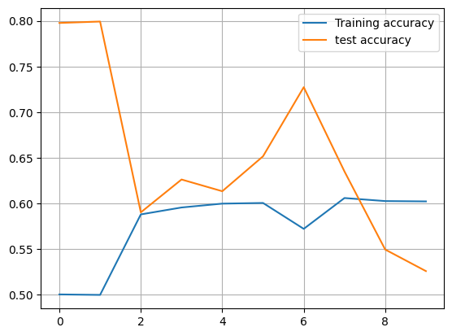
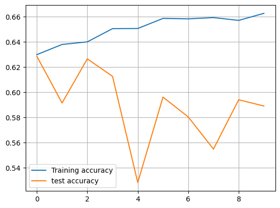

# Predicting Medical Appointment No-Shows using Multi-Layer Perceptrons in PyTorch

## Abstract
Medical appointment no-shows represent a significant challenge in healthcare systems,
leading to inefficiencies and increased costs. This study investigates the *Medical
Appointment No Shows* dataset using Artificial Neural Networks (ANNs), specifically
multi-layer perceptron (MLP) models implemented in PyTorch. The research focuses on
data preprocessing, model implementation, and extensive experimentation with
activation functions, optimizers, loss functions, initialization techniques, and
architectural variations (wide vs. deep networks). The results highlight the effects of
different hyperparameter configurations on prediction performance and suggest future
directions for enhancing predictive accuracy in real-world applications.

---

## 1. Introduction
Patient adherence to medical appointments is a critical factor for effective healthcare
delivery. However, many patients fail to attend their scheduled visits. Predicting these
no-shows can help optimize scheduling and resource allocation.  
The *Medical Appointment No Shows* dataset provides demographic and contextual
information about patients, such as age, gender, neighborhood, scholarship status,
SMS reminders, and appointment dates.  
This study applies deep learning techniques, particularly MLPs, to predict patient
attendance and explores how model architecture and hyperparameters influence
performance.

---

## 2. Dataset Description
The dataset contains over 100k appointment records with the following key features:
- **Demographic:** Age, Gender, Neighborhood, Scholarship status.
- **Temporal:** Scheduled date/time, Appointment date/time.
- **Behavioral/Contextual:** SMS received, comorbidities (e.g., hypertension, diabetes).
- **Target Variable:** `No-show` (1 = showed up, 0 = missed).

### 2.1 Exploratory Data Analysis

<div align="center">

#### Gender Distribution  


#### Age Distribution  


#### No-show Distribution  


#### Age vs Gender  


#### Correlation Heatmap  


</div>

---

## 3. Data Preprocessing
1. **Column removal:** Dropped identifiers (`PatientId`, `AppointmentID`) and redundant date columns.
2. **Date processing:** Extracted day, month, year, and *part-of-day* (morning,
afternoon, evening).
3. **Categorical encoding:** Applied one-hot encoding on categorical variables
(`Gender`, `Neighbourhood`, `PartOfDay`, `No-show`).
4. **Scaling:** Used `StandardScaler` to normalize numeric features.
5. **Imbalance handling:** Addressed class imbalance using `RandomUnderSampler`.

---

## 4. Model Implementation
An MLP model was developed using PyTorch with the following characteristics:
- Input layer dimension = number of features after preprocessing.
- Hidden layers with configurable neurons (e.g., 256 → 16).
- Dropout layers for regularization.
- Output layer with a **Sigmoid** activation for binary classification.

**Base Training Setup:**
- Optimizer: SGD (lr=0.01)
- Loss function: BCE (binary cross entropy)
- Epochs: 10
- Batch size: 16
- Metrics: Accuracy, Precision, Recall, F1-score

---

## 5. Experiments
The study systematically evaluated:

### 5.1 Activation Functions
- **Sigmoid:** Best performance (Test Accuracy ≈ 0.6524).  
- **Tanh:** Slightly lower accuracy (~0.618).  
- **ReLU:** Underperformed (~0.597).  

<div align="center">

### (Sigmoid)  


</div>

<div align="center">
### (ReLU)


</div>

---

### 5.2 Optimizers
- **SGD:** Most consistent results (~0.65 accuracy).  
- **Adam:** Slightly lower performance (~0.63).  
- **RMSprop:** Lowest performance (~0.61).  

<div align="center">

### (Adam)  


</div>

<div align="center">
  
### (SGD)


</div>

---

### 5.3 Loss Functions
- **BCE:** Highest accuracy (~0.65).  
- **MSE:** Lower accuracy (~0.61).  
- **L1:** Performed worst (~0.58).  

<div align="center">

### (BCE)  


</div>

<div align="center">
  
### (MSE)


</div>

---

### 5.4 Learning Rates
- lr = 0.001 → stable but slower convergence.  
- lr = 0.01 → optimal balance (best results).  
- lr = 0.1 → unstable but sometimes peaked higher accuracy.  

<div align="center">

### (0.01)  


</div>

<div align="center">
  
### (0.001)


</div>

---

### 5.5 Regularization & Initialization
- **Dropout:** Helped mitigate overfitting.  
- **L2 Regularization:** Added stability.  
- **Xavier Initialization:** Improved convergence consistency.

---

### 5.6 Wide vs. Deep Architectures
To understand the impact of network structure, two design strategies were compared:

- **Wide networks (more neurons per layer):**  
  Increasing the number of neurons in each hidden layer improved the model’s capacity to capture complex relationships. However, this also introduced a higher risk of overfitting, especially with limited training epochs. Training was faster due to shallower depth, but generalization to unseen data was weaker.

- **Deep networks (more layers with fewer neurons):**  
  Stacking additional hidden layers allowed the model to learn hierarchical feature representations. This configuration provided more flexibility and sometimes led to better generalization. However, it required more computation and was prone to unstable convergence if not carefully initialized and regularized.

- While both strategies have trade-offs, results suggested that **wide networks provided faster convergence but tended to overfit**, whereas **deep networks were more stable in the long run but computationally heavier**. Neither approach drastically outperformed the other for this dataset, indicating that architecture depth/width alone was not the key factor in improving accuracy.


---

### 5.7 Cross-Validation
- 4-fold cross-validation confirmed results’ robustness.  
- Accuracy varied between **0.20 and 0.63** depending on configuration.

---

## 6. Results

- Best overall configuration: **MLP with Sigmoid activation, BCE loss, SGD optimizer (lr=0.01), Xavier initialization, dropout=0.5**  
- Test Accuracy peaked at **~65%**.  
- Performance limited by dataset imbalance and feature complexity.


### 🔹 Classification Report (Best Model)

```
          precision    recall  f1-score   support

       0       0.71      0.84      0.77     1740
       1       0.49      0.31      0.38      680

accuracy                           0.65     2420
macro avg     0.60       0.57      0.58     2420
weighted avg  0.64       0.65      0.64     2420

```


---

## 7. Discussion
- Activation functions significantly influence model stability. Sigmoid performed best for this dataset, despite ReLU being the standard in many domains.
- SGD outperformed adaptive optimizers, suggesting that simpler methods may generalize better here.
- Regularization and proper initialization were critical in avoiding overfitting.
- Despite tuning, model performance remained moderate, likely due to feature sparsity and inherent unpredictability in patient attendance.

---

## 8. Conclusion and Future Work
This research demonstrated the application of MLPs for predicting medical
appointment no-shows using PyTorch. While results achieved moderate success
(~65% accuracy), there is room for improvement. Future work could explore:
- More advanced architectures (Wide & Deep, Attention-enhanced MLPs).  
- Automated hyperparameter optimization (Bayesian optimization, genetic algorithms).  
- Alternative neural network types (Graph Neural Networks, Transformers).  
- Incorporating external features (e.g., socioeconomic factors, historical attendance patterns).  

---

## References
- Glorot, X., & Bengio, Y. (2010). Understanding the difficulty of training deep feedforward neural networks. *AISTATS*.  
- Kaggle: Medical Appointment No Shows Dataset (2016).  
- PyTorch Documentation: https://pytorch.org/docs  
